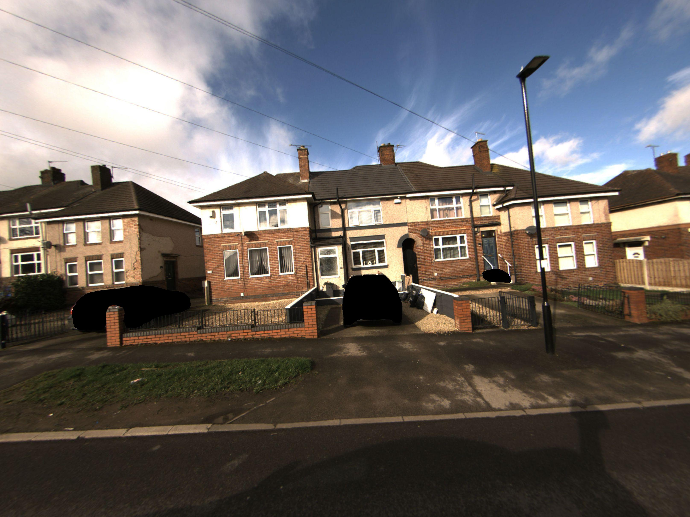
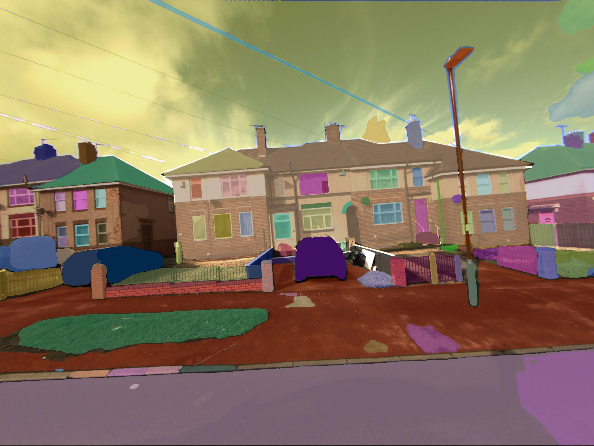

# Additional Data Information

In this document we look at each data modality and note any additional information that would be useful to users of the xri-alpha-sandbox.

## UPRN Level Information

We should briefly note that the [OS Open UPRN](https://osdatahub.os.uk/downloads/open/OpenUPRN), dataset from which we acquire the building identifiers and their geospatial locations, does possess some oddities and errors. 

UPRNs are often assigned to objects we are not interested in, each parks and playgrounds, old postboxes etc..., bits of waste ground where buildings once stood. At this stage in our pipeline development, without manually checking it is very difficult to know if a UPRN is one of an active UPRN with a building or not. Thus, some none buildings can appear in the dataset.

## RGB

The RGB cameras used fisheye lenses to increase their FOV. We performed fisheye lens correction which required the calculation of a number of parameters. Currently this is only calculated for two out of the four cameras used in the creation of this dataset. We still apply distortion correction using the parameters from the calculated cameras to the uncalculated as the values will be very similar, but this is a known limitation and going forward all cameras will have their own distortion correction procedures.

It should also be noted that generally the edges of even the rectified images possess some rectification artefacts and the aim should be to use predominantly the centre of the image.

At some point for a brief period during alpha data capture in winter 2023-24, the RGB cameras were swapped from left to right without this being recorded. They were then swapped back. Therefore, it is possible that in some UPRNs have RGB images are facing the away from the UPRNs. The raw data was screened before the alpha-sandbox was chosen so this should not be the case but it is a possibility to be aware of as we expand the alpha-sandbox dataset.

  
  

## IR

Similarly the IR images have been rectified to correct for distortion for their own optics setups. Similarly rectification parameters were only calculated for two out of four cameras, same as the RGB setup.

Unlike the RGB however the outermost regions of the IR images and temperature arrays have been masked out, this is due to hot edges due to the IR detector heating itself up during operation. In the temperature arrays the masked areas are NaN elements in the numpy array.

  

